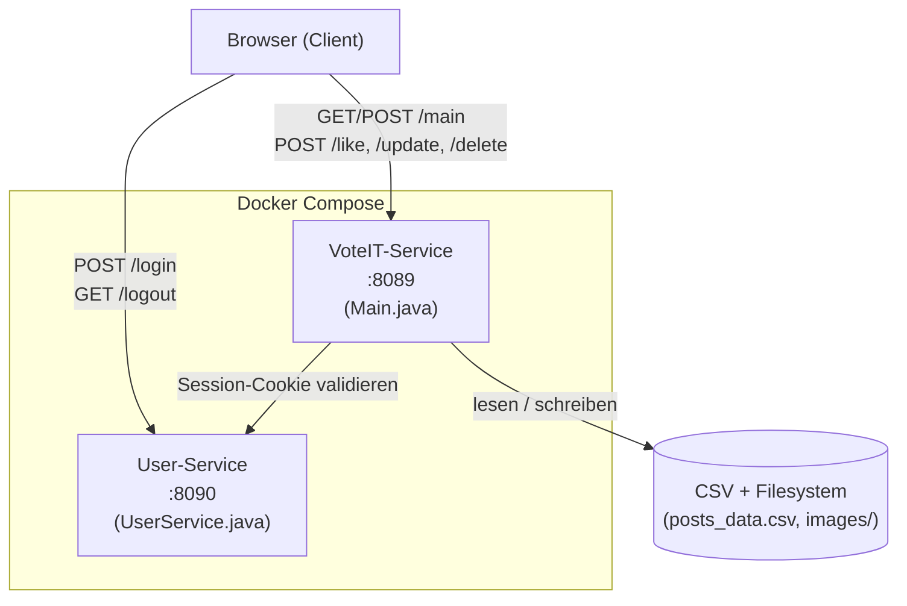
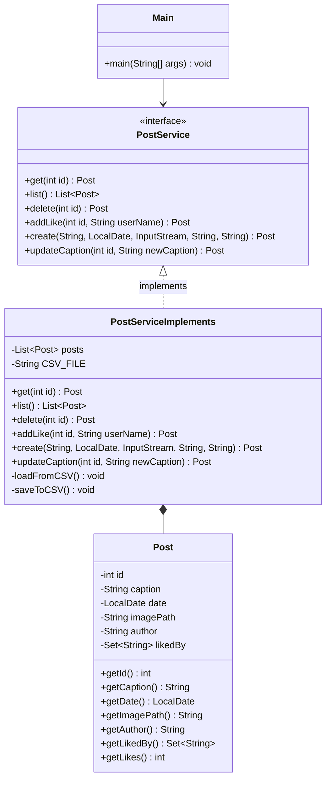
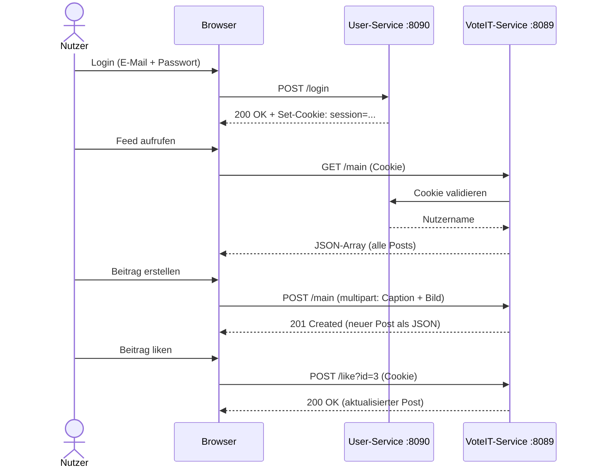

# VoteIT

VoteIT ist eine einfache Web-App zum Teilen von Fotos und Videos innerhalb einer Gruppe. Nutzer können Beiträge erstellen, liken und wieder löschen. Das Projekt wurde im Rahmen des DevOps-Kurses als Microservice-Anwendung umgesetzt.

## Wie das Ganze aufgebaut ist

Die App besteht aus zwei Services die getrennt laufen:

- **User-Service (Port 8090)** – kümmert sich nur ums Login und setzt ein Cookie wenn die Credentials stimmen
- **VoteIT-Service (Port 8089)** – der eigentliche Hauptservice, macht alles mit den Posts (anzeigen, erstellen, liken, löschen)

Die zwei Services reden nicht direkt miteinander, der VoteIT-Service liest einfach das Cookie das der User-Service gesetzt hat.

### Komponentendiagramm



### Klassendiagramm (VoteIT-Service)

Der VoteIT-Service ist in Schichten aufgeteilt: `Main.java` übernimmt das HTTP-Routing, `PostService` definiert die Schnittstelle zur Geschäftslogik und `PostServiceImplements` setzt sie um. `Post` ist das Datenmodell.



### Sequenzdiagramm – Login und Post erstellen



## Technologie

- Java 17 ohne externe Frameworks (nur `com.sun.net.httpserver`)
- HTML/CSS/JavaScript im Frontend
- Daten werden in einer CSV-Datei gespeichert, Bilder/Videos im lokalen Ordner
- Docker + Docker Compose für die Container
- GitHub Actions für CI/CD

## API-Endpunkte

| Endpunkt | Methode | Beschreibung |
|---|---|---|
| `/main` | GET | Alle Posts als JSON |
| `/main` | POST | Neuen Post anlegen (multipart mit Bild/Video) |
| `/like?id=X` | POST | Like togglen (einmal = like, nochmal = unlike) |
| `/update?id=X` | POST | Beschreibung ändern |
| `/delete?id=X` | POST | Post löschen |

## Starten

### Mit Docker Compose (Lokale Installation von Docker vorausgesetzt)

```bash
docker-compose up --build
```

Danach läuft die App unter `http://localhost:8089`.

### Manuell mit Java

Zwei Terminals öffnen:

**Terminal 1:**
```bash
cd user-service
javac UserService.java
java UserService
```

**Terminal 2:**
```bash
cd voteit-service
javac *.java
java Main
```

## CI/CD Pipeline

Bei jedem Push auf `main` läuft automatisch:
1. Kompilieren beider Services
2. Unit-Tests für User-Service und VoteIT-Service
3. Docker Images bauen und in die GitHub Container Registry pushen

## Test-Zugänge

| Name | E-Mail | Passwort |
|---|---|---|
| Caro | finkca.vi23@stud.gera.dhge.de | password123 |
| Stephan | teegst.vi23@stud.gera.dhge.de | password456 |
| Joanna | gramjo.vi23@stud.gera.dhge.de | password123 |
| Irene | haerir.vi23@stud.gera.dhge.de | password456 |
