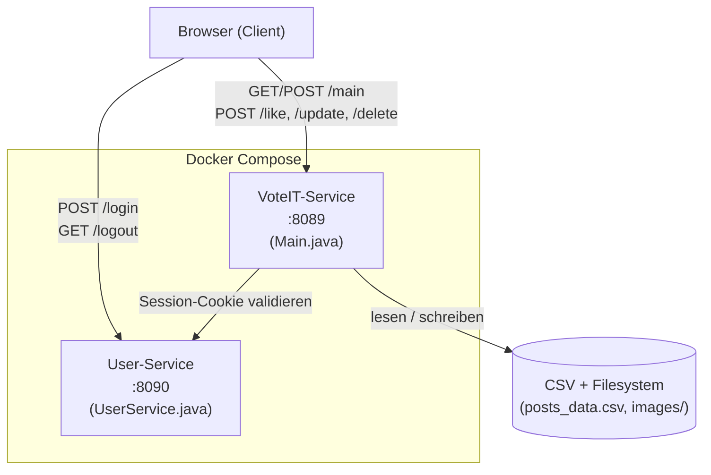
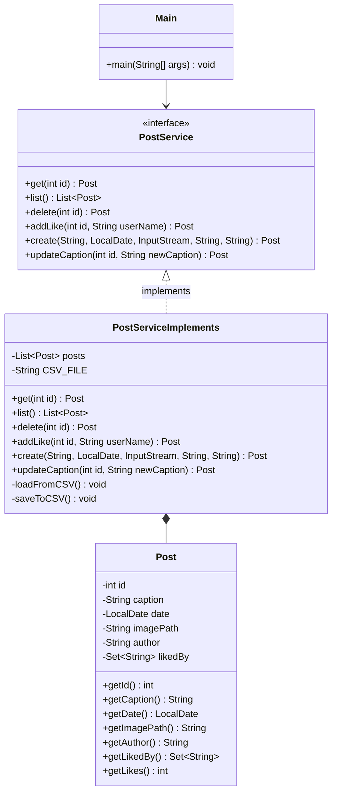
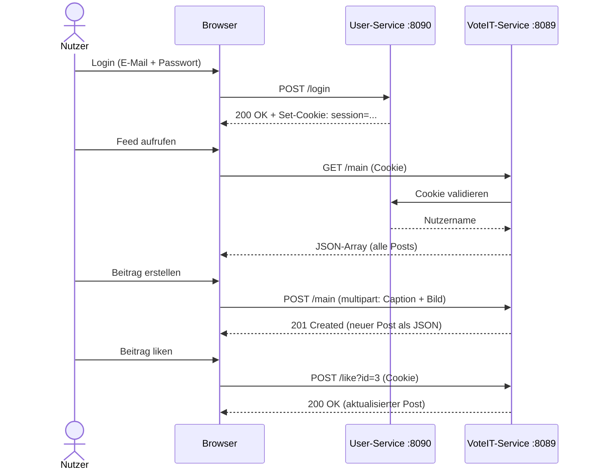

# VoteIT

VoteIT ist eine einfache Web-App zum Teilen von Fotos und Videos innerhalb einer Gruppe. Nutzer können Beiträge erstellen, liken und wieder löschen. Das Projekt wurde im Rahmen des DevOps-Kurses als Microservice-Anwendung umgesetzt.

## Wie das Ganze aufgebaut ist

Die App besteht aus zwei Services die getrennt laufen:

- **User-Service (Port 8090)** – kümmert sich nur ums Login und setzt ein Cookie wenn die Credentials stimmen
- **VoteIT-Service (Port 8089)** – der eigentliche Hauptservice, macht alles mit den Posts (anzeigen, erstellen, liken, löschen)

Die zwei Services reden nicht direkt miteinander, der VoteIT-Service liest einfach das Cookie das der User-Service gesetzt hat.

### Komponentendiagramm

Das Diagramm zeigt wie Browser, die beiden Services und der Datei-Speicher zusammenhängen. Der Browser spricht beide Services direkt an, der VoteIT-Service fragt beim User-Service nach ob das Cookie gültig ist bevor er eine Anfrage bearbeitet.



### Klassendiagramm (VoteIT-Service)

Der VoteIT-Service ist in Schichten aufgeteilt: `Main.java` übernimmt das HTTP-Routing, `PostService` definiert die Schnittstelle zur Geschäftslogik und `PostServiceImplements` setzt sie um. `Post` ist das Datenmodell.



### Sequenzdiagramm – Login und Post erstellen

Hier sieht man den zeitlichen Ablauf wenn sich ein Nutzer einloggt und danach einen Beitrag erstellt. Gut zu sehen ist dass der VoteIT-Service bei jeder Anfrage erst das Cookie beim User-Service prüft bevor er antwortet.



## Technologie

- Java 17 ohne externe Frameworks (nur `com.sun.net.httpserver`)
- HTML/CSS/JavaScript im Frontend
- Daten werden in einer CSV-Datei gespeichert, Bilder/Videos im lokalen Ordner
- Docker + Docker Compose für die Container
- GitHub Actions für CI/CD

## API-Endpunkte

| Endpunkt | Methode | Beschreibung |
|---|---|---|
| `/main` | GET | Alle Posts als JSON |
| `/main` | POST | Neuen Post anlegen (multipart mit Bild/Video) |
| `/like?id=X` | POST | Like togglen (einmal = like, nochmal = unlike) |
| `/update?id=X` | POST | Beschreibung ändern |
| `/delete?id=X` | POST | Post löschen |

## Starten

### Mit Docker Compose (Lokale Installation von Docker vorausgesetzt)

```bash
docker-compose up --build
```

Danach läuft die App unter `http://localhost:8089`.

### Manuell mit Java

Zwei Terminals öffnen:

**Terminal 1:**
```bash
cd user-service
javac UserService.java
java UserService
```

**Terminal 2:**
```bash
cd voteit-service
javac *.java
java Main
```

## CI/CD Pipeline

Die Pipeline läuft über **GitHub Actions** und ist in der Datei `.github/workflows/pipeline.yml` definiert. Sie startet automatisch bei jedem Push auf den `main`-Branch.

Die Pipeline ist in zwei Jobs aufgeteilt:

**Job 1 – `build-and-test`:**
1. Repository auschecken
2. Java JDK 17 einrichten (Amazon Corretto)
3. User-Service kompilieren (`javac UserService.java UserServiceTest.java`)
4. Unit-Tests User-Service ausführen (`java UserServiceTest`)
5. VoteIT-Service kompilieren (`javac *.java`)
6. Unit-Tests VoteIT-Service ausführen (`java PostServiceTest`)
7. Release-Paket als ZIP-Artefakt in GitHub Actions hochladen

**Job 2 – `deliver`** (läuft nur wenn Job 1 erfolgreich war):
1. Docker Image für den User-Service bauen und in die GitHub Container Registry (GHCR) pushen
2. Docker Image für den VoteIT-Service bauen und in die GHCR pushen

Die Images sind danach unter `ghcr.io/<username>/voteit-user-service:latest` bzw. `ghcr.io/<username>/voteit-app:latest` abrufbar. Für den Login bei der Registry wird der automatisch von GitHub bereitgestellte `GITHUB_TOKEN` genutzt – es sind keine manuell hinterlegten Secrets nötig.

## Unit-Tests

Für beide Services gibt es eigene Testklassen die bei jedem Pipeline-Durchlauf automatisch ausgeführt werden. Schlägt ein Test fehl bricht die Pipeline ab und es wird kein neues Image gebaut.

**PostServiceTest.java** (VoteIT-Service) – testet die Kernlogik der Post-Verwaltung:
- Erstellen eines Posts und prüfen ob Caption korrekt gesetzt wurde
- Like-Toggle: erster Klick erhöht den Like-Zähler, zweiter Klick senkt ihn wieder
- Löschen eines Posts und prüfen ob er danach wirklich nicht mehr abrufbar ist
- Abfragen der gesamten Post-Liste

**UserServiceTest.java** (User-Service) – testet das Parsen der Login-Daten und die Authentifizierung:
- `extractParam` liest einen einzelnen Parameter korrekt aus dem Request-Body
- Fehlender Parameter gibt einen leeren String zurück statt einen Fehler zu werfen
- `%40` im URL-kodierten Body wird korrekt als `@` dekodiert (wichtig für E-Mail-Adressen)
- Login mit korrekten Zugangsdaten gibt `true` zurück
- Login mit falschem Passwort oder unbekannter E-Mail gibt `false` zurück
- Nach erfolgreichem Login wird der richtige Nutzername (z.B. "Joanna") aufgelöst

## Test-Zugänge

| Name | E-Mail | Passwort |
|---|---|---|
| Caro | finkca.vi23@stud.gera.dhge.de | password123 |
| Stephan | teegst.vi23@stud.gera.dhge.de | password456 |
| Joanna | gramjo.vi23@stud.gera.dhge.de | password123 |
| Irene | haerir.vi23@stud.gera.dhge.de | password456 |

> **Hinweis zu Secret Management:** Die Zugangsdaten sind hier zu Testzwecken direkt im Quellcode hinterlegt (`UserService.java`). Das entspricht nicht dem Standard für Produktiv-Umgebungen. Dort würden Passwörter gehasht (z.B. mit bcrypt) in einer Datenbank gespeichert und sensible Konfigurationen wie API-Keys oder DB-Credentials über Umgebungsvariablen oder ein Secret-Management-System (z.B. HashiCorp Vault oder GitHub Secrets) bereitgestellt – nie direkt im Code.

## Hinweis zur Datenpersistenz

Aktuell werden alle Post-Daten in einer einfachen CSV-Datei (`posts_data.csv`) gespeichert, Bilder und Videos direkt im lokalen Dateisystem. Das reicht für dieses Projekt, hat aber offensichtliche Grenzen: keine gleichzeitigen Schreibzugriffe, kein echter Query-Support, und die Daten sind weg wenn der Container neu gebaut wird.

In einer echten Produktiv-Umgebung würde man das ersetzen durch:
- Eine relationale Datenbank (z.B. PostgreSQL) für die Post-Metadaten
- Einen externen Objekt-Speicher (z.B. AWS S3 oder MinIO) für Bilder und Videos
- Die Datenbank würde als eigener Container laufen und per Docker Compose eingebunden
